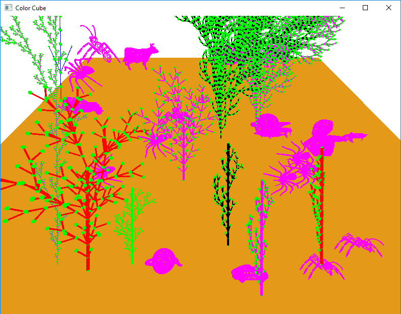

# CS543_ComputerGraphics_HW3:Hierarchical 3D Modeling of L-System Trees

Demo:https://www.youtube.com/watch?v=rVUEfLsCp_k&feature=youtu.be

Generate a forest of trees using an iterated function system (IFS) called Lindenmayer Systems (a.k.a. L-Systems), and place those trees on a "ground plane." I also insert PLY models of a car and other PLY objects and place it on the ground plane to model a park.
